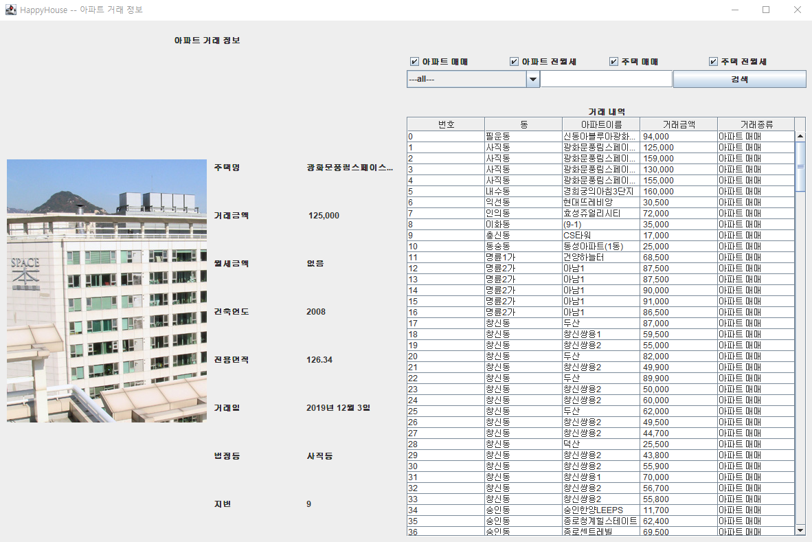
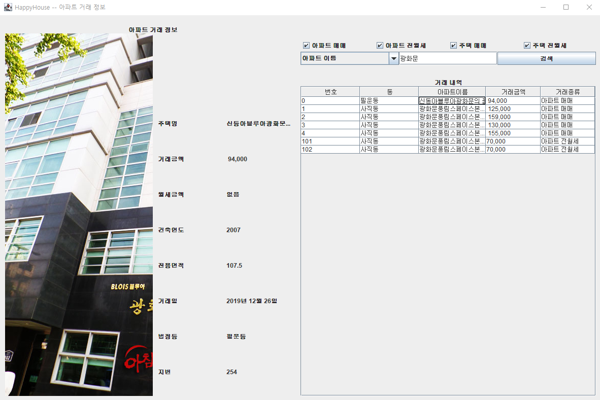
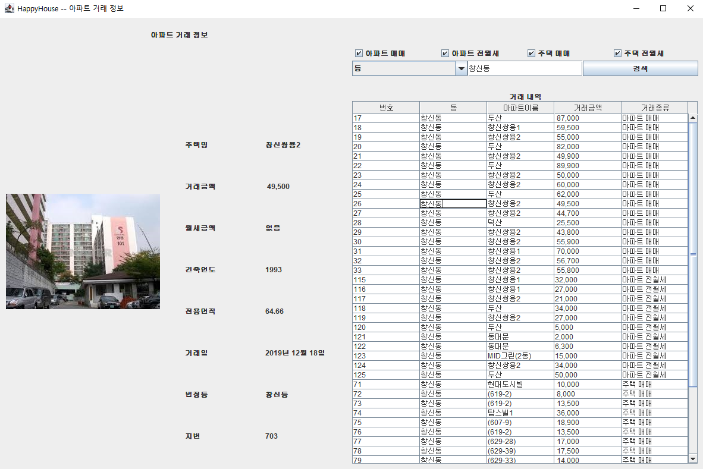
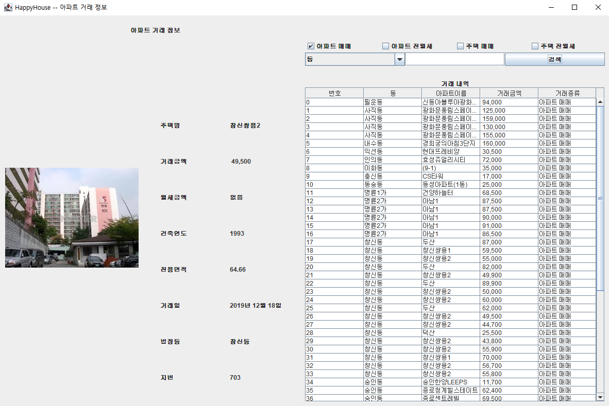
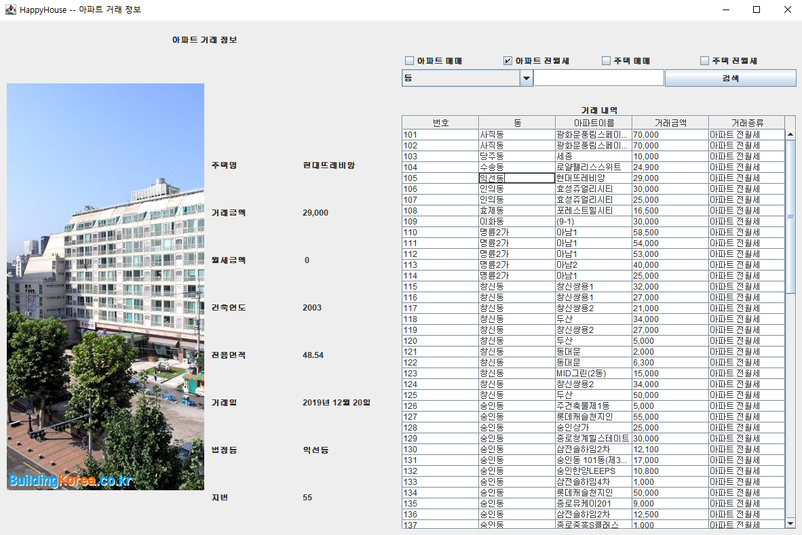
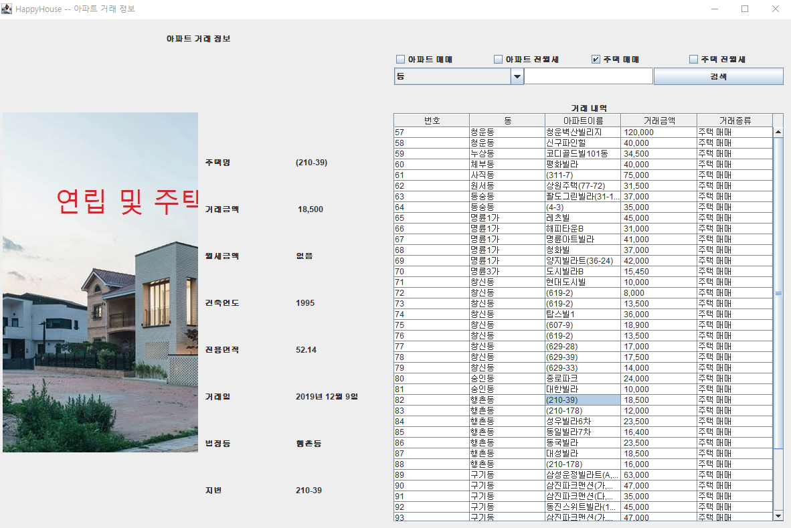
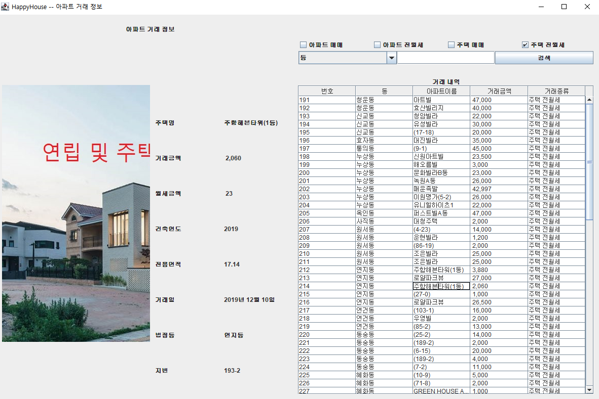

 
<h1 align="center">Happy House</h1>
 

## 목차

1. [**프로젝트 소개**](#1)
2. [**팀원 소개**](#2)
3. [**기술 스택**](#3)
4. [**프로젝트 목표**](#4)
5. [**프로젝트 기능**](#5)
6. [**실행 화면**](#6)

 

## 💁 프로젝트 소개

&nbsp;&nbsp; 사용자에게 원하는 `부동산 정보를 제공`해주는 서비스

 

## 👪 팀원 소개

| 역할 |  이름  |
| :--: | :----: |
| 팀장 | 박정환 |
| 팀원 | 승나연 |
| 팀원 | 민성재 |

 

## 🛠 기술 스택

- 

 

## 🎯 프로젝트 목표

- 객체지향 개념과 Java 프로그램의 기본 구조 및 흐름을 이해하고 활용할 수 있다.
- GUI (Java Swing) Event 처리 코드를 Lambda 로 작성할 수 있다.
- XML, CSV 등 데이터 문서로부터 원하는 정보를 파싱(Parsing) 할 수 있다.

 

## 💡 프로젝트 기능

- 고객이 화면 UI를 통해서 원하는 주택 정보를 검색(조회) 하면 해당 요청을 XML 파일 기반 데이터를 이용하여 화면에 보여 지도록 구현

- 검색(조회) 기능은 동 또는 아파트를 구분해서 선택한 후, 검색어로 검색(조회) 할 수 있고, 대상이 되는 데이터를 아파트 매매, 아파트 전, 월세, 주택 매매, 주택 전, 월세로 구분하여 선택할 수 있도록 체크박스를 제공

 

## 📄 실행 화면

| 아무런 조건도 주지 않았을 경우 (모든 부동산 정보 제공) |
| :----------------------------------------------------: |
|               |

|                     동으로 조회한 경우                      |                 아파트 이름으로 조회한 경우                 |
| :---------------------------------------------------------: | :---------------------------------------------------------: |
|  |  |

|                     아파트 매매로 조회한 경우                     |                    아파트 전월세로 조회한 경우                    |
| :---------------------------------------------------------------: | :---------------------------------------------------------------: |
|  |  |

|                        주택 매매로 조회한 경우                        |                       주택 전월세로 조회한 경우                       |
| :-------------------------------------------------------------------: | :-------------------------------------------------------------------: |
|  |  |
